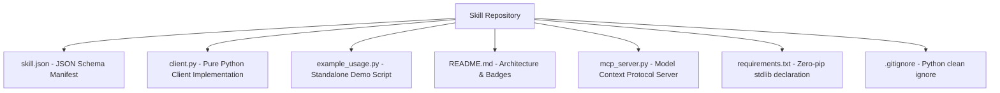

# GenPark AI (@alphaparkinc)

<div align="center">


**The World's Largest Pure-Standard Library AI Agent Skill Ecosystem**  
*Ultra-fast, zero-dependency, production-hardened capabilities for Autonomous Agents and Model Context Protocol (MCP).*

</div>

---

### 🌐 Organization Highlights & Metrics

```
  ⭐ 10,260+ Stars Across 1,198 Open-Source Repositories
  🤖 1,039+ Production AI Agent Skills
  ⚡ 100% Pure Python Standard Library (Zero external pip dependencies)
  🔌 100% Model Context Protocol (MCP) Compatible
  🔒 100% Air-Gapped & Enterprise Security Ready
```

---

### 🏛️ Core Technology Capability Domains

| Capability Domain | Flagship Skill Repositories | Key Technical Highlights |
|---|---|---|
| **Autonomous Operators & Web Agents** | `genpark-autonomous-generalist-browser-workflow-executor-skill`<br>`genpark-autonomous-dom-tree-vision-web-interactor-skill` | End-to-end task automation, accessibility tree grounding, vision coordinate clicking |
| **LLM Inference & Quantization** | `genpark-multi-head-latent-attention-kv-compressor-skill`<br>`genpark-ternary-weight-1bit-quantized-gemm-kernel-skill` | DeepSeek MLA KV compression (14x savings), BitNet 1.58-bit ternary GEMM |
| **Diffusion & World Models** | `genpark-rectified-flow-transformer-diffusion-sampler-skill`<br>`genpark-joint-embedding-predictive-world-representation-skill` | Flux.1 DiT rectified flow trajectories, V-JEPA latent space dynamics prediction |
| **Edge Voice & Cross-Lingual Audio** | `genpark-ultra-lightweight-edge-neural-speech-synthesizer-skill`<br>`genpark-zero-shot-cross-lingual-voice-clone-translator-skill` | Kokoro 82M ultra-fast TTS (20x RTF), zero-shot voice timbre cloning & lip-sync |
| **Test-Time Compute & Reasoning Trees** | `genpark-test-time-search-tree-verifier-skill`<br>`genpark-tree-of-thought-multi-agent-debate-verifier-skill` | OpenAI o3-mini style MCTS rollouts, Tree-of-Thought multi-agent refutation |
| **DevSecOps & Model Governance** | `genpark-automated-secret-detection-sast-security-gatekeeper-skill`<br>`genpark-open-model-registry-license-compliance-auditor-skill` | GitLab SAST Shannon entropy security gates, OpenCSG Starship license auditor |
| **Confidential RAG & AI Firewalls** | `genpark-multi-tenant-federated-rag-privacy-enclave-skill`<br>`genpark-deterministic-tool-call-guardrail-firewall-skill` | Zero-knowledge proof privacy enclaves, NeMo guardrail tool execution firewalls |

---

### 🚀 Standard 7-File Architecture per Skill

Every GenPark skill repository conforms to a strict, production-ready standardized layout:



---

### 🔌 Model Context Protocol (MCP) Quickstart

Connect any GenPark AI Agent Skill directly to Claude Desktop, Cursor, Antigravity, or any MCP-compatible agent client:

```bash
python mcp_server.py
```

```json
{
  "mcpServers": {
    "genpark-skill": {
      "command": "python",
      "args": ["mcp_server.py"]
    }
  }
}
```

---

<div align="center">
  <sub>Maintained with ❤️ by the <b>GenPark AI</b> Engineering Organization · <a href="https://genpark.ai">genpark.ai</a></sub>
</div>
