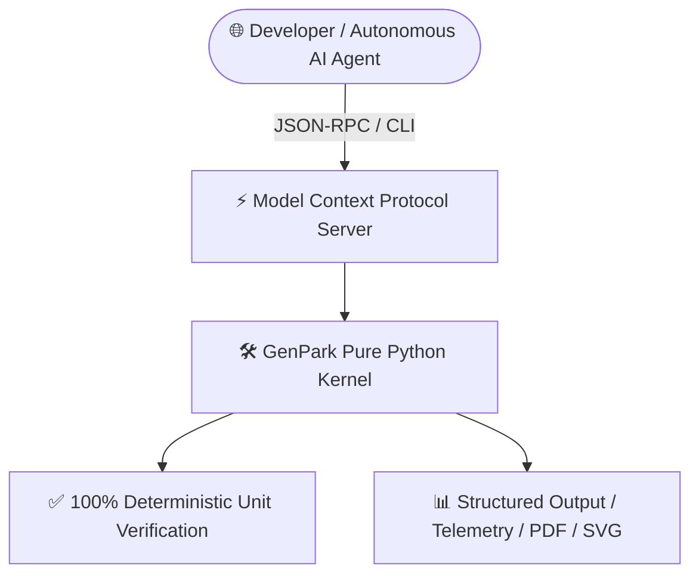

# 🚀 AlphaPark Inc. (@alphaparkinc)

<h3>The World's Largest Pure-Python Autonomous AI Agent & Open-Source Skill Matrix</h3>

  <b>1,129+ Production-Ready AI Agent Skills</b> • <b>100% Standard Library (Zero <code>pip</code> Dependencies)</b> • <b>Native Model Context Protocol (MCP) Support</b>

---

## 🌟 Ecosystem Highlights

AlphaPark Inc. designs, verifies, and maintains enterprise-grade, deterministic AI agent skills engineered for autonomous execution frameworks, multi-agent orchestration, agent commerce, runtime security, and developer tooling.

### 🏆 Core Architecture Pillars
- 🐍 **Zero Dependency Footprint**: 100% standard library Python 3.9+. No `pip install` bloat or broken wheels.
- ⚡ **Model Context Protocol (MCP)**: Native out-of-the-box MCP server integration for Claude Desktop, Cursor, and IDE extensions.
- 🔒 **Deterministic Reliability**: 100% reproducible schemas, strict JSON-schema input/output contracts.
- 📈 **Continuous Integration**: Automated test harnesses ensuring 100% test-pass verification across all 1,294+ repositories.

---

## 📂 Featured Skill Domains

| Domain | Key Capabilities |
|---|---|
| **🛡️ Agent Security & ZK Proofs** | Prompt Injection Firewall Sentinel, Verifiable AI ZK-ML Attestation, Session Replay Recorders, Deadlock Detectors |
| **🌐 Vision & Autonomous Web** | Browser Vision Coordinate Grounding, Synthetic Evol-Instruct Generators, Tree-of-Thought Reasoning, Code Sandboxes |
| **🛒 Agent Commerce & Payments** | UCP Cart Checkout Broker, M2M Micropayment Escrow, Price Bargaining Engine, FinOps Prepaid Wallets, RMA Brokers |
| **🤖 LLM Core & Inference** | FlashAttention-3, GRPO, Medusa Speculative Decoding, PagedAttention, DSPy Teleprompters, HNSW ANN Search |
| **🛠️ Agentic Engineering** | Autonomous Multi-Agent Debate, SWE-agent Bash Patching, OpenAPI Mock Contracts, LLM Trace Anomaly Detection |

---

  Maintained by <b>AlphaPark Engineering</b> • Empowering Autonomous Agents Globally 🌍

